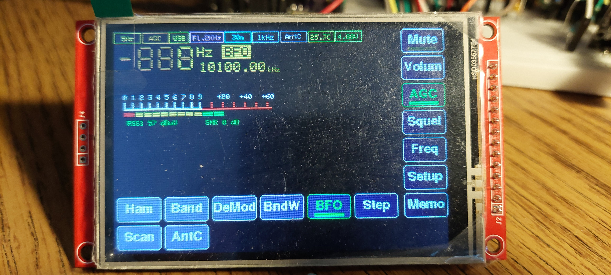
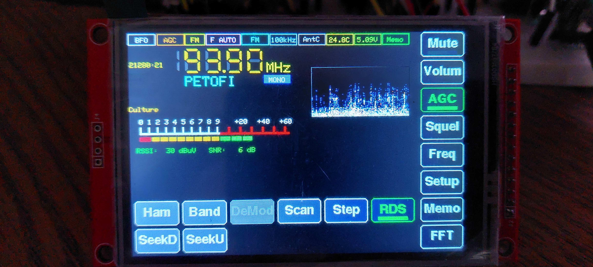
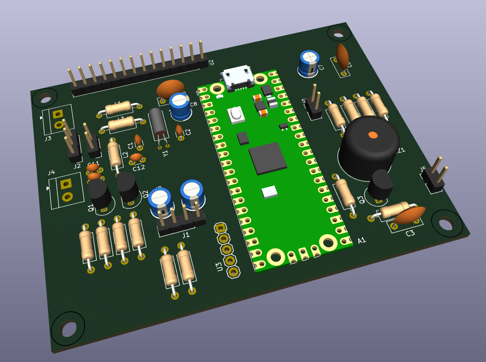
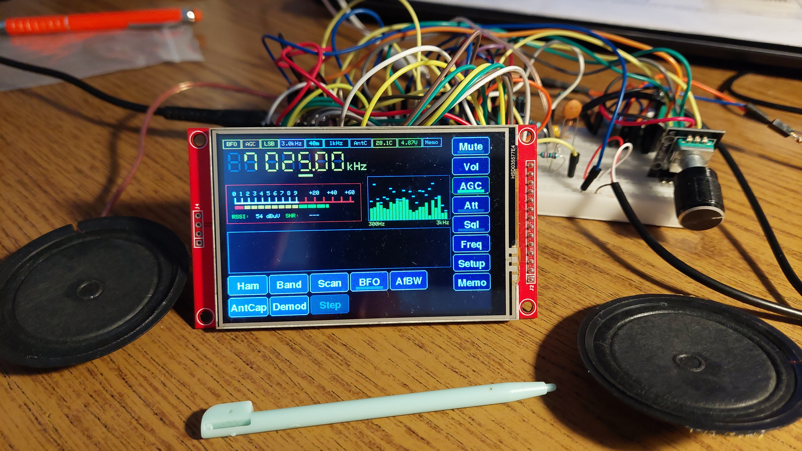

# Pico-Radio-5




## Hardver részletesen

A Pico-Radio-5 egy fejlett, több sávos rádióvevő, amely a Raspberry Pi Pico (RP2040) mikrokontroller köré épül. A főbb hardverelemek:

- **Raspberry Pi Pico**  
  ARM Cortex-M0+ dual-core MCU, 2MB flash, 264kB RAM, USB programozás.
- **SI4735 rádió IC**  
  Digitális rádióvevő chip, amely támogatja az FM (RDS), AM (MW, LW, SW) sávokat, digitális vezérléssel (I2C).
- **TFT érintőkijelző**  
  320x240 vagy 480x320 felbontású, színes, érintésérzékeny kijelző (TFT_eSPI driverrel).
- **Rotary encoder**  
  Mechanikus forgó kódoló, amely a frekvencia, hangerő, menük vezérlésére szolgál (kattintás érzékelés is).
- **Hangkimenet**  
  3.5mm jack vagy beépített hangszóró, SI4735 audio kimenet közvetlenül vagy erősítőn keresztül.
- **Akkumulátor mérés**  
  Feszültségosztóval a Pico ADC-n keresztül, töltöttség kijelzés.
- **EEPROM**  
  Állomásmemória, beállítások tartós tárolása.
- **Egyéb**  
  Nyomógombok, szenzorok (pl. hőmérséklet), LED-ek, opcionális bővítések.

A részletes kapcsolási rajzok, NYÁK-tervek a `doc/` mappában találhatók:
- [Kapcsolási rajz (PDF)](doc/pico-radio-5-sch.pdf)
- [NYÁK terv (PDF)](doc/pico-radio-5-pcb.pdf)
- 



## Szoftver részletesen

A szoftver PlatformIO környezetben, C++ nyelven, Arduino frameworkre épül. Főbb könyvtárak: PU2CLR SI4735, TFT_eSPI, RPI_PICO_TimerInterrupt.

### Fő funkciók

- **Rádió sávok**: FM (RDS), AM (MW, LW, SW), SSB/CW támogatás (ha SI4735 patch betöltve)
- **Állomáskeresés, finomhangolás**: automatikus és kézi keresés, lépésköz választás
- **Állomásmemória**: FM/AM/SW/LW sávonként, EEPROM-ban tárolva
- **RDS támogatás**: FM sávban állomásnév, rádiószöveg, PTY, óra
- **Grafikus kezelőfelület**: érintőképernyő, rotary encoder, menük, dialógusok, státuszsor
- **Képernyővédő**: animált frekvencia kijelzés, energiatakarékosság
- **Spektrumkijelzés**: FFT-alapú vizualizáció (ha támogatott)
- **Beállítások**: hangerő, sáv, lépésköz, kijelző fényerő, képernyővédő időzítés, stb.
- **Akkumulátor kijelzés**: töltöttség százalékban, színkódolva
- **Debug és diagnosztika**: soros porton részletes log, hibakereséshez

### Mappastruktúra

- `src/` – Fő forráskód (képernyők, rádió logika, UI, stb.)
- `include/` – Fejlécfájlok, interfészek, konstansok
- `doc/` – Dokumentáció, kapcsolási rajzok, NYÁK-tervek, minták
- `test/` – Egységtesztek, tesztkódok
- `platformio.ini` – PlatformIO projektkonfiguráció

### Főbb forrásfájlok

- `main.cpp` – Inicializálás, fő programciklus
- `ScreenFM.cpp`, `ScreenAM.cpp`, stb. – Különböző rádió sávok kezelői
- `ScreenSaverScreen.cpp` – Képernyővédő logika
- `FreqDisplay.cpp` – Frekvencia kijelző komponens
- `Config.cpp` – Beállítások kezelése, EEPROM mentés/betöltés
- `Si4735Manager.cpp` – SI4735 IC vezérlés, sávváltás, frekvenciaállítás

### Fordítás és feltöltés

1. Telepítsd a PlatformIO-t (ajánlott: VSCode bővítményként)
2. Nyisd meg a projektet VSCode-ban
3. Csatlakoztasd a Raspberry Pi Pico-t USB-n keresztül
4. Válaszd ki a Pico-t mint céleszközt
5. Kattints a Build (vagy Upload) gombra, vagy futtasd:  
   `pio run --target upload`
6. A feltöltés után a rádió automatikusan elindul

### Fejlesztői információk

- A kód moduláris, minden képernyő külön osztályban van
- A beállítások és állomásmemória EEPROM-ban tartósan tárolódik
- A hardveres I2C lábak, rotary encoder, kijelző, stb. pinjei a `pins.h`-ban konfigurálhatók
- Hibakereséshez a soros porton részletes log érhető el

## TFT_eSPI beállítás

A projekt a TFT_eSPI könyvtárat használja a kijelző kezeléséhez. A helyes működéshez a `doc/TFT_eSPI/User_Setup.h` fájlt be kell másolni a PlatformIO által használt TFT_eSPI könyvtár megfelelő mappájába. Ez általában:

```
.pio/libdeps/pico/TFT_eSPI/User_Setup.h
```

A másolás után a kijelző a projektben definiált beállításokkal fog működni. Ha másik kijelzőt használsz, módosítsd a `User_Setup.h`-t a saját hardveredhez.

## Licenc

A projekt szabadon felhasználható, módosítható, forrásmegjelöléssel. Lásd a forráskód fejléceit.

---

